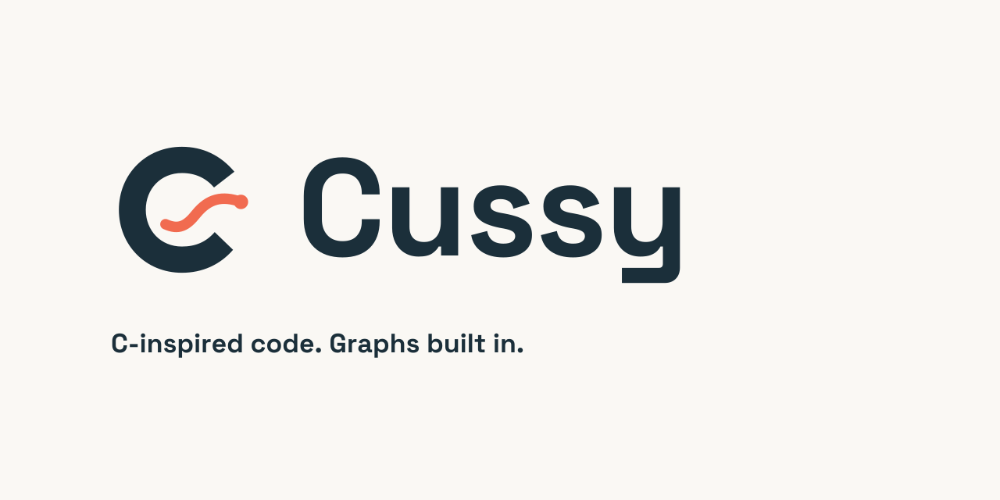

# Cussy logo

An open **C** frames a rising graph curve and its endpoint: C-inspired syntax,
with mathematics and graphing built in. The wordmark uses outlined Space Grotesk
Bold. Ink and coral give the identity a clear silhouette in code editors,
documentation, and small icons.



[Download the complete logo kit](https://github.com/cussylang/cussylang/raw/main/assets/brand/cussy-brand-kit.zip)

## Choose an asset

| Use | Asset |
| --- | --- |
| README, website, documentation on light backgrounds | [Light wordmark SVG](cussy-wordmark-light.svg) |
| Dark backgrounds | [Dark wordmark SVG](cussy-wordmark-dark.svg) |
| Standalone symbol | [Light mark SVG](cussy-mark-light.svg) · [Dark mark SVG](cussy-mark-dark.svg) |
| One-color printing | [Black wordmark SVG](cussy-wordmark-black.svg) · [White wordmark SVG](cussy-wordmark-white.svg) |
| Profile or app icon | [Avatar SVG](cussy-avatar.svg) · [1024 px PNG](png/cussy-avatar-1024.png) |
| Repository/social card | [Social preview SVG](cussy-social.svg) · [1280 × 640 PNG](png/cussy-social-1280.png) |
| Browser or desktop shortcut | [Multi-size ICO](cussy.ico) |

Every SVG also has a matching **vector PDF** in [pdf/](pdf/) and **vector EPS**
in [eps/](eps/). The paths remain editable and scale without pixelation; there
are no embedded bitmaps, external fonts, scripts, or linked images. PDF and EPS
can be opened by common vector illustration and page-layout tools.

[PNG exports](png/) include transparent marks at 128, 256, 512, 1024, and 2048 px,
transparent wordmarks at 840 and 1680 px wide, and opaque avatar/social images.
PNG and ICO are raster companions, not scalable vector originals. The ZIP
contains all variants, this guide, the font source/license, and a SHA-256 file
manifest. A white vector export needs to be placed on a dark background to be
visible; it intentionally has no background rectangle.

## Color and placement

| Color | Hex | Use |
| --- | --- | --- |
| Ink | `#1B2F3A` | Primary lettering and avatar background |
| Coral | `#F16B50` | Curve and endpoint on light backgrounds |
| Paper | `#FAF8F4` | Social preview background |
| Light | `#F2F4F5` | Lettering on dark backgrounds |
| Soft coral | `#FF967E` | Curve and endpoint on dark backgrounds |

Keep the proportions intact. Leave clear space around the mark, ideally at least
one stroke width. Use the standalone mark at small sizes; use the wordmark when
the name needs to be read. The 256-unit SVG canvas includes padding around the
192-unit-high symbol. Start at 24 px for the symbol or 180 px for the wordmark.

## Source and reproduction

The symbol is original vector artwork defined in
[`scripts/build_brand.py`](https://github.com/cussylang/cussylang/blob/main/scripts/build_brand.py). It was constructed from
paths, not traced from a bitmap or borrowed from another logo. The wordmark is
set in [Space Grotesk](https://github.com/floriankarsten/space-grotesk), with every
glyph converted to a path. The unmodified font and its [SIL Open Font License](source/OFL.txt)
are included in `source/`; the upstream revision is recorded in [manifest.json](manifest.json).
Original artwork follows the repository's [MIT license](LICENSE.txt).

To rebuild the exports from the repository root:

```sh
python3 -m venv .venv-brand
.venv-brand/bin/pip install CairoSVG==2.9.0 fonttools==4.63.0 Pillow==12.0.0
.venv-brand/bin/python scripts/build_brand.py
```

CairoSVG also requires the Cairo system library. Generation is a maintainer task;
using the logo or compiling Cussy does not require these Python dependencies.
The script also refreshes the PNG used by the VS Code starter. Renderer versions
can affect export bytes; the manifest describes the checked-in files.
