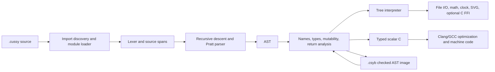

# Architecture and engineering boundaries

Cussy 0.2.0 is a Rust library plus a binary. The Rust dependencies are serde and
serde_json, used for versioned AST images. Standard libraries are Cussy source
embedded with `include_str!`; their host operations are implemented in Rust.

| File | Responsibility |
|---|---|
| `ast.rs` | Serializable type, expression, statement, function and program nodes |
| `lexer.rs` | UTF-8 literals, exact integers, nested comments, spans |
| `parser.rs` | C-shaped declarations/control flow and Pratt expressions |
| `loader.rs` | Embedded/local modules, dependency order, identity/cycle checks |
| `checker.rs` | Name resolution, aliases, structure validation, type and return checks |
| `value.rs` | Values, storage cells, copies, identity, storage invalidation |
| `runtime.rs` | Lexical environments, interpreter, call scopes, checked arithmetic |
| `native.rs` | Prelude/host functions, formatting, regression, input/output |
| `plot.rs` | Curve sampling and standalone accessible SVGs |
| `ffi.rs` | Small opt-in Unix dlopen double(double) boundary |
| `formatter.rs` | Comment-aware, token-preserving layout |
| `main.rs` | CLI, artifact serialization, persistent REPL |
| `codegen.rs` | Checked scalar native lowering and explicit unsupported diagnostics |
| `compile.rs` | Optimization flags, compiler invocation, staged output publication |
| `codegen_runtime.h` | Native arithmetic, strings, formatting and diagnostics |
| `codegen_float.h` | Adapted Ryu binary64 formatting with bundled Boost license |

## Type and storage model

The checker uses a type namespace plus nested value scopes. Function signatures
are registered before bodies. Struct fields and aliases are resolved centrally;
recursive by-value objects and duplicate definitions are rejected. Data-dependent
checks stay in the runtime: indexes, array allocation lengths, signed-to-unsigned
conversion, division, pointer lifetime, library errors, and format arguments.
Function return analysis is conservative and does not try to prove termination.
Checked function bodies are shared through `Rc`, and call frames retain the global
scope instead of copying its name table. Lookup searches only the current function
frame and globals, keeping caller locals inaccessible. [Benchmarks](../benchmarks/README.md)
measure the change without changing language semantics.

Storage cells are `Rc<RefCell<Slot>>`, each carrying type, mutability, alive state,
and heap ownership. Arrays/objects own child cells. Copying aggregates creates new
cells, while copying pointers preserves referenced identity. Leaving a scope or
freeing an allocation invalidates its owned cells. Pointers keep invalid cells
observable long enough to produce a diagnostic instead of touching reclaimed
native memory. Same-shape assignments preserve child addresses. `locked` is
checked statically; pointer pointee mutability is independent of the pointer binding.

This is an interpreter memory model, not a layout-compatible C heap. It uses
reference counting, not tracing collection: pointer cycles can retain storage.
No concurrency is implemented. Object destruction is not user-programmable.

## Build format

`cussy compile` emits typed GNU C11 for the supported scalar subset, then invokes
Clang/GCC to emit assembly, an object, or an executable. It uses native values and
function calls and does not embed the interpreter. Checked arithmetic, call depth,
and output limits remain; the interpreter fuel budget is not applied to native
execution. [Native compilation](native.md) documents its supported operations and
toolchain. The following format belongs to the separate `cussy build` command.

`.csyb` is a JSON object tagged `cussy-ast-v1` plus the exact package version and a
serialized Program. It contains imported AST nodes and source text for diagnostics.
It contains no native machine code, optimizer output, or embedded runtime. Loading
validates the format/version and reruns semantic checking. Images can contain
source text, so they are not a source-hiding or signing format. They remain code
with normal filesystem/environment capabilities, not a security boundary.

## Budgets and limitations

- 5,000,000 AST execution steps by default (`--fuel` changes this), call depth 128,
  syntactic nesting 256, module nesting about 64.
- The CLI executes on one worker thread with a 16 MiB stack so recursive programs
  can reach the checked call-depth limit even on systems with small default
  stacks. Library embedders must provide sufficient stack space themselves.
- Each declared array allocation is capped at 1,000,000 elements. These caps are
  practical guardrails, not a complete memory quota or denial-of-service sandbox.
- Captured output and individual checked string/file operations use an 8 MiB
  ceiling. Some host operations allocate before checking their result length.
- Graphs use 801 samples, basic jump-breaking, and optional y clipping. Point-valued
  plots preserve equal axis unit scales by expanding the viewport. Discontinuous,
  oscillatory, or poorly scaled functions can need different domains/ranges.
- Lists contain floats. No heterogeneous lists, generators, automatic broadcasting
  across differing lengths, symbolic algebra, automatic derivatives/integrals,
  nonlinear regression, 3D renderer, or interactive plot controls.
- `addaterm` aliases types, values and ordinary functions. No general macros,
  namespaces, package manager, generics, overloads, raw pointer casts, bitwise ops,
  union, goto, or volatile/static qualifiers. Native optimization applies only to
  the supported scalar subset; aggregate and graph programs use the interpreter.
- No exceptions/catch, async tasks, threads, debugger, LSP, Desmos API access,
  YouTube live status, or live Geometry Dash integration.
- Dynamic FFI is Unix-only and explicitly unsafe. ABI mistakes bypass interpreter
  guarantees. Only a single float argument and float result are supported.

## Validation and platform status

Run `cargo test --locked`, `cargo fmt --check`, and
`cargo clippy --locked --all-targets -- -D warnings`.
Tests include behavior checks and rejection cases, detached artifact execution,
REPL persistence, module diamonds/cycles, native cos, SVG structure, file I/O,
array/record copies, overflow, pointer scope exit, null and double-free errors,
linear regression, collision/practice state, and every ordinary example.

The implementation was built and executed on macOS arm64 with Rust 1.96.1.
The repository runs Linux/macOS/Windows CI and a Rust 1.88 minimum-version job.
Consult the [Actions page](https://github.com/cussylang/cussylang/actions) for current
remote results; the minimum toolchain was also checked and tested locally. Unix FFI tests use libSystem on macOS and libm on
Linux. The editor grammar is validated as JSON; desktop VS Code extension-host
behavior must be checked by launching its Extension Development Host.

## Extending Cussy

Add syntax to AST/parser, then implement its static rule in Checker and runtime
behavior in Runtime. Add a behavior test and at least one relevant rejection case.
For standard-library functionality, prefer a small `.cussy` function. Host operations
need a signature in `builtin_types`, an implementation in `native`, and a public
alias/wrapper in the relevant embedded module. Keep public documentation and editor
keywords consistent with the implemented grammar.
